# 基于SSM的汽车销售系统 

（源代码+12000字文档+ppt）

## 项目简介

汽车销售系统是一套非常完善的网上汽车销售商城系统。主要分为用户端和后台管理端。 
用户端是给用户使用，可以在首页查看所有汽车信息，并且可以对其进行收藏或者添加购物车下单，付款完成后即可等待管理员发货。收到汽车之后可以对其进行收货并且可以发表自己的评价等。 
管理端是给网站管理员使用，可以对汽车信息进行维护，可以查看用户的订单信息，并且对其进行发货。可以对汽车的出入库进行盘点，还可以发布网站公告等。 
本系统后端使用spring+springmvc+mybatis框架。数据库使用的是mysql数据库。 
该系统功能完善，界面美观，非常适合作为毕设或者课程作业以及新手开发学习。 

## 视频介绍
<a href="https://www.bilibili.com/video/BV1RkYyeZEZ4/?spm_id_from=333.999.0.0" target="_blank">点击查看B站视频介绍</a>

## 功能介绍
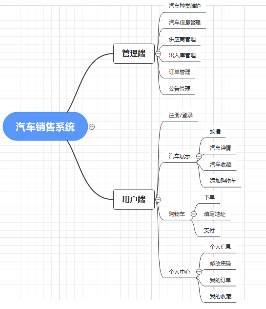 

## 技术服务

## 系统图片
#### 1.用户端首页
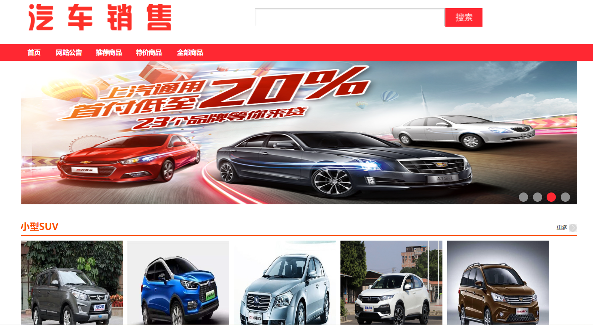 
#### 2.汽车详情
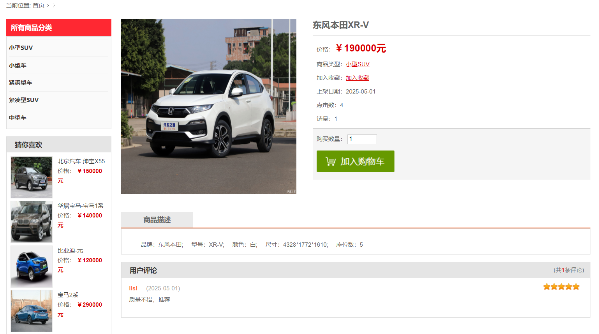 
#### 3.添加购物车
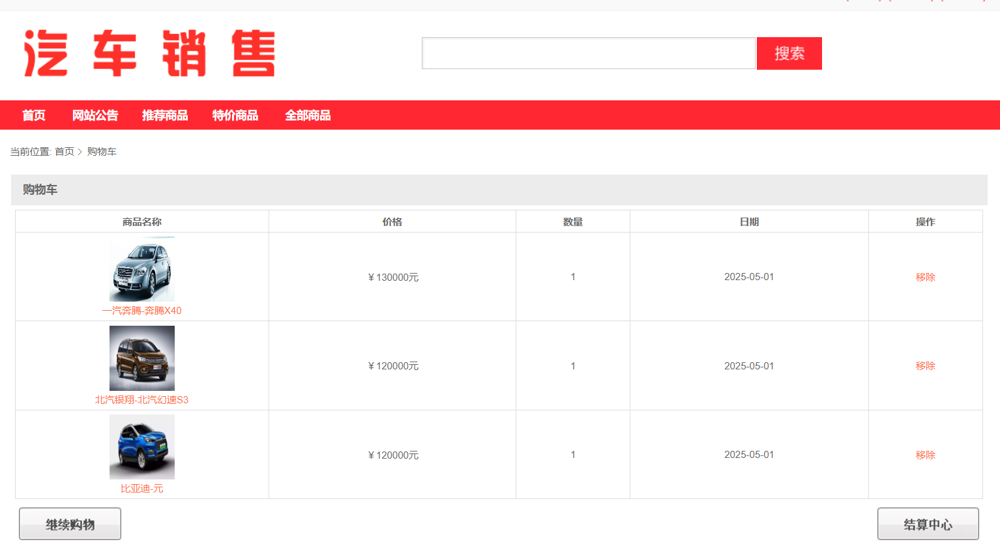 
#### 4.下单付款
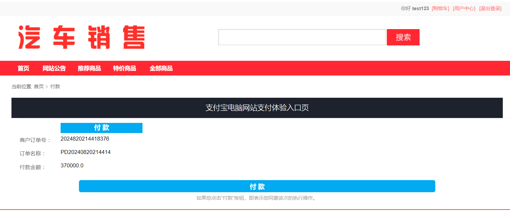 
#### 5.管理端登录
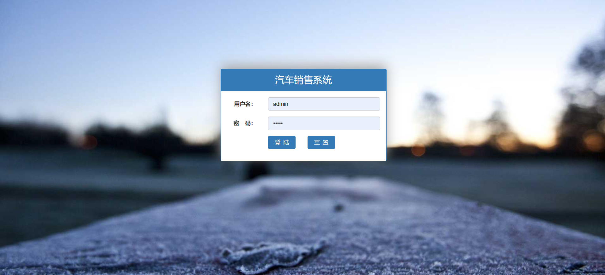 
#### 6.汽车信息管理
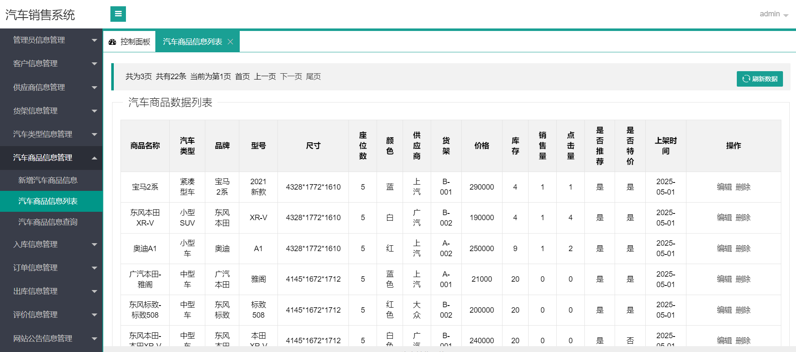 
#### 7.订单信息管理
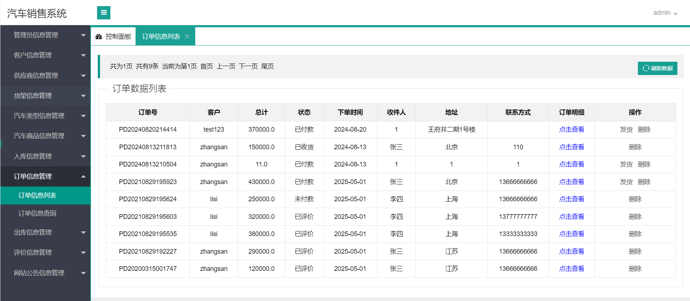 
#### 8.供应商管理
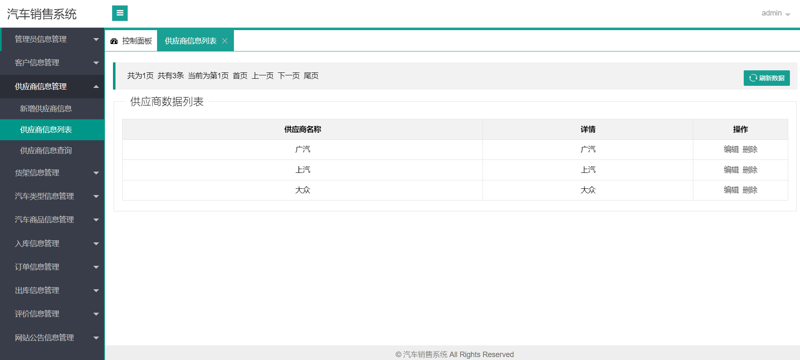 
#### 9.评价订单信息
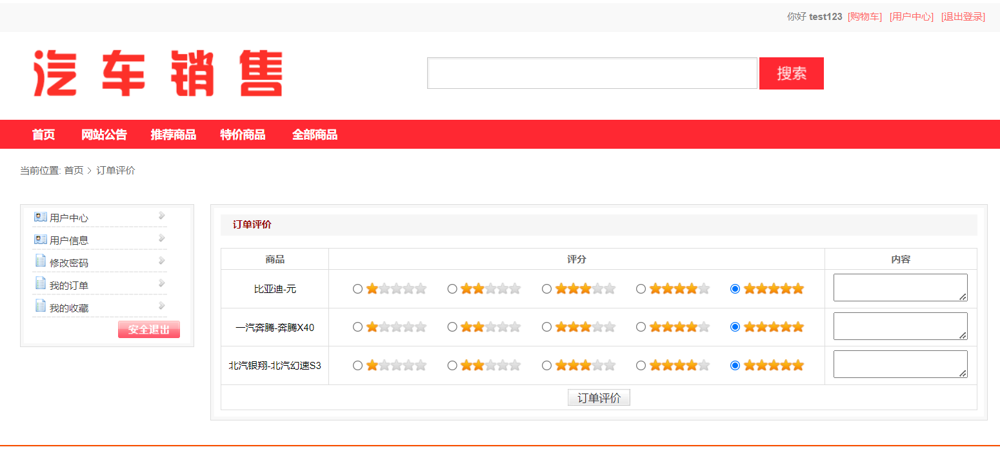 
#### 10.出入库信息管理
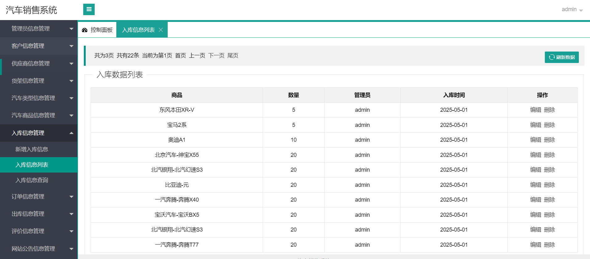 
